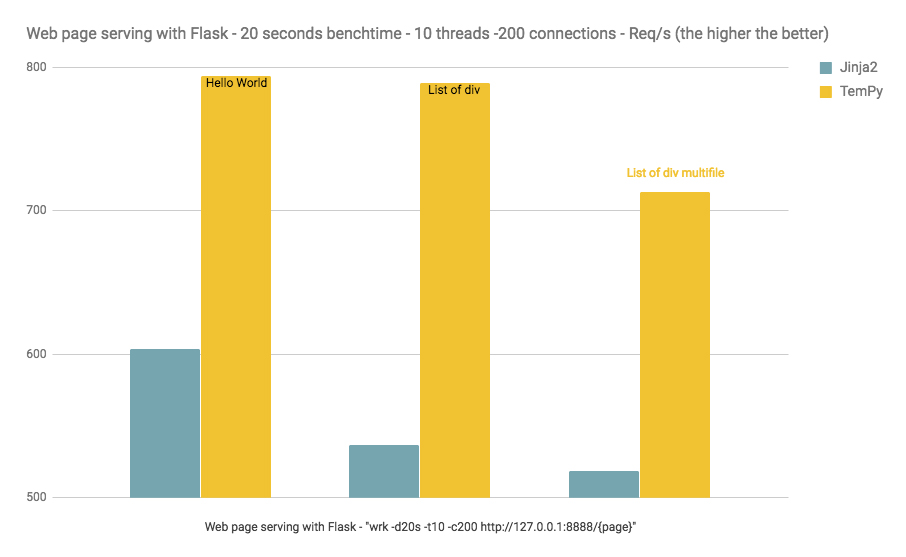
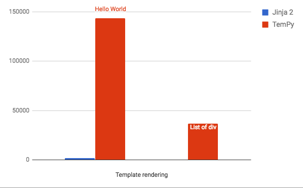

# TemPy


[](https://img.shields.io/github/release/Hrabal/TemPy.svg)
[](https://badge.fury.io/py/tem-py) [](https://pypi.org/project/tem-py/) [](https://travis-ci.org/Hrabal/TemPy) [](https://coveralls.io/github/Hrabal/TemPy?branch=master) [](https://codebeat.co/projects/github-com-hrabal-tempy-master) [](https://codeclimate.com/github/Hrabal/TemPy) [](https://www.codacy.com/app/federicocerchiari/TemPy?utm_source=github.com&amp;utm_medium=referral&amp;utm_content=Hrabal/TemPy&amp;utm_campaign=Badge_Grade) [](https://raw.githubusercontent.com/Hrabal/TemPy/master/LICENSE) [](https://saythanks.io/to/Hrabal) [](http://pepy.tech/count/tem-py)

### Fast Object-Oriented HTML templating With Python!

### What?
Build HTML without writing a single tag.
TemPy dynamically generates HTML and accesses it in a pure Python or jQuery fashion. Navigating the DOM and manipulating tags is also possible in a Python or jQuery-similar syntax.

### Why?
HTML is like SQL: we all use it, we know it works, we all recognize it's important, but our biggest dream is to never write a single line of it again. For SQL we have ORM's, but we're not there yet for HTML.
Templating systems are cool (Python syntax in HTML code) but not cool enough (you still have to write HTML somehow) ... so the idea of TemPy emerges.

### Weeeeeeee!
No parsing and a simple structure makes TemPy fast. TemPy simply adds HTML tags around your data, and the actual HTML string exists only at render time.
See below for benchmarks against other templating engines.

### Read the full documentation here: [https://hrabal.github.io/TemPy/](https://hrabal.github.io/TemPy/)
*****

### Build, manipulate, and navigate HTML documents, with no HTML involved.

Overview: 

* [Building the DOM, basic usage](#basic-usage)
* [Building separate blocks, nesting and re-usability](#building-blocks)
* [OOT - Object-Oriented Templating](#oot---object-oriented-templating)
* [TemPy REPR, set and forget](#tempy-reprs)
* [DOM elements API, change your page dynamically](#elements-api)
* [DOM navigation, it's a tree!](#dom-navigation)
* [Tag attributes, it's a tag!](#tag-attributes)

# Usage
### Installation
TemPy is avaiable on PyPi: `pip3 install tem-py`.

Or clone/download this repository and run `python3 setup.py install`

### Building the DOM

#### Basic Usage

TemPy offers clean syntax for building pages in pure python:
```python
from tempy.tags import Html, Head, Body, Meta, Link, Div, P, A
my_text_list = ['This is Foo.', 'This is Bar.', 'Have you met my friend Baz?']
another_list = ['Lorem ipsum ', 'dolor sit amet, ', 'consectetur adipiscing elit']

# make tags instantiating TemPy objects
page = Html()(  # add tags inside the one you created calling the parent
    Head()(  # add multiple tags in one call
        Meta(charset='utf-8'),  # add tag attributes using kwargs in tag initialization
        Link(href="my.css", typ="text/css", rel="stylesheet")
    ),
    body=Body()(  # give them a name so you can navigate the DOM with those names
        Div(klass='linkBox')(
            A(href='www.foo.com')
        ),
        (P()(text) for text in my_text_list),  # tag insertion accepts generators
        another_list  # add text from a list, str.join is used in rendering
    )
)

# add tags and content later
page[1][0](A(href='www.bar.com'))  # calling the tag
page[1][0].append(A(href='www.baz.com'))  # using the API
link = A().append_to(page.body[0]) # access the body as if it's a page attribute
page.body(testDiv=Div()) # WARNING! Correct ordering with named Tag insertion is ensured with Python >= 3.5 (because kwargs are ordered)
link.attr(href='www.python.org')('This is a link to Python.') # Add attributes and content to already placed tags

page.render()
>>> <html>
>>>     <head>
>>>         <meta charset="utf-8"/>
>>>         <link href="my.css" type="text/css" rel="stylesheet"/>
>>>     </head>
>>>     <body>
>>>         <div class="linkBox">
>>>             <a href="www.foo.com">www.foo.com</a>
>>>             <a href="www.bar.com">www.bar.com</a>
>>>             <a href="www.baz.com">www.baz.com</a>
>>>             <a href="www.python.org">This is a link to Python.</a>
>>>         </div>
>>>         <p>This is Foo.</p>
>>>         <p>This is Bar.</p>
>>>         <p>Have you met my friend Baz?</p>
>>>         Lorem ipsum dolor sit amet, consectetur adipiscing elit
>>>         <div></div>
>>>     </body>
>>> </html>
```

#### Building Blocks
You can also create blocks and put them together using the manipulation API, each TemPy object can be used later inside other TemPy object:
```python
# --- file: base_elements.py
from somewhere import links, foot_imgs
# define some common blocks
header = Div(klass='header')(title=Div()('My website'), logo=Img(src='img.png'))
menu = Div(klass='menu')(Li()(A(href=link)) for link in links)
footer = Div(klass='coolFooterClass')(Img(src=img) for img in foot_imgs)
```
```python
# --- file: pages.py
from base_elements import header, menu, footer

# import the common blocks and use them inside your page
home_page = Html()(Head(), body=Body()(header, menu, content='Hello world.', footer=footer))
content_page = Html()(Head(), body=Body()(header, menu, container=Div(klass='container'), footer=footer))
```
```python
# --- file: my_controller.py
from tempy.tags import Div
from pages import home_page, content_page

@controller_framework_decorator
def my_home_controller(url='/'):
    return home_page.render()

@controller_framework_decorator
def my_content_controller(url='/content'):
    content = Div()('This is my content!')
    return content_page.body.container.append(content).render()
```

#### OOT - Object Oriented Templating
TemPy is designed to provide Object Oriented Templating. You can subclass TemPy classes and add custom HTML tree structures to use as blocks.

```python
from tempy.widgets import TempyPage

class BasePage(TempyPage):
    def js(self):
        return [
            Script(src="//ajax.googleapis.com/ajax/libs/jquery/1.9.1/jquery.min.js"),
        ]

    def css(self):
        return [
            Link(href=url_for('static', filename='style.css'),
                 rel="stylesheet",
                 typ="text/css"),
            Link(href='https://fonts.googleapis.com/css?family=Quicksand:300',
                 rel="stylesheet"),
            Link(href=url_for('static',
                              filename='/resources/font-awesome-4.7.0/css/font-awesome.min.css'),
                 rel="stylesheet"),
        ]

    # Define the init method as a constructor of your block structure
    def init(self):
        self.head(self.css(), self.js())
        self.body(
            container=Div(id='container')(
                title=Div(id='title')(
                    Div(id='page_title')(A(href='/')('MySite')),
                    menu=self.make_menu('MAIN')
                ),
                content=Div(id='content')(Hr())
            )
        )
    
    # Your subclass can have its own methods like any other class
    def make_menu(self, typ):
        return Div(klass='menu')(
                            Nav()(
                                Ul()(
                                    Li()(
                                        A(href=item[1])(item[0]))
                                    for item in self.get_menu(typ)
                                )
                            ),
                        )

    def get_menu(self, typ):
        return [(mi.name, mi.link)
                for mi in Menu.query.filter_by(active=True, menu=typ
                                               ).order_by(Menu.order).all()]

```

...you can then sublass your custom TemPy object to add specific behavior:
```python
class HomePage(BasePage):

    def init(self):
        self.body.container.content(
            Div()(
                Br(),
                'This is my home page content', Br(),
                H3()('Hame page important content'),
                'Look, I\'m a string!', Br(),
                H3()('H3 is big, really big'),
                H1()('Today\'s content:'),
                self.get_dynamic_content()
            )
        )

    def get_dynamic_content(self):
        # Here using SQLAlchemy:
        current_content = Content.query.outerjoin(Content.comments).order_by(Content.date.desc(), Content.id.desc()).limit(1).first()
        if not current_content:
            return 'No content today!'
        return Div()(Span()(current_content.title),
                     Span()(current_content.text)),
                     Div()(comment for comment in current_content.comments))
```

TemPy executes each base class `init` method in reverse mro, so your subclass can access all the elements defined in its parent classes.

#### TemPy Reprs

Another way to use TemPy is to define a nested `TempyREPR` class inside your classes:
```python
class MyClass:
    def __init__(self):
        self.foo = 'foo'
        self.bar = 'bar'

    class HtmlREPR(TempyREPR):
        def repr(self):
            self(
                Div()(self.foo),
                Div()(self.bar)
            )
```
You can think the `TempyREPR` as a `__repr__` equivalent, so when an instance is placed inside a TemPy tree, the `TempyREPR` subclass is used to render the instance.

You can define several `TempyREPR` nested classes, and when dealing with a non-TemPy object, TemPy will search for a `TempyREPR` subclass following this priority:
* a `TempyREPR` subclass with the same name of his TemPy container.
* a `TempyREPR` subclass with the same name of his TemPy container's root.
* a `TempyREPR` subclass named `HtmlREPR`.
* the first `TempyREPR` found.
* if none of the previous if found, the object will be rendered calling his `__str__` method.

You can use this order to set different renderings for different situations/pages:

```python
class MyClass:
    def __init__(self):
        self.foo = 'foo'
        self.bar = 'bar'
        self.link = 'www.foobar.com'
    
    # If an instance on MyClass is found inside a div
    class Div(TempyREPR):
        def repr(self):
            self(
                Div()(self.foo),
                Div()(self.bar)
            )
    
    # If an instance on MyClass is found inside a link
    class A(TempyREPR):
        def repr(self):
            self.parent.attrs['href'] = self.link
            self('Link to ', self.bar)

    # If an instance on MyClass is found inside a table cell
    class Td(TempyREPR):
        def repr(self):
            self(self.bar.upper())
    
    # If an instance on MyClass is found when rendering the a TempyPage called 'HomePage'
    class HomePage(TempyREPR):
        def repr(self):  # note: here self is the object's parent, not the root
            self('Hello World, this is bar: ', self.bar)
```

### Elements API
Create DOM elements by instantiating tags:
```python
page = Html()
>>> <html></html>
```

Add elements or content by calling them like a function...
```python
page(Head())
>>> <html><head></head></html>
```
...or use one of the jQuery-like APIs:
```python
body = Body()
page.append(body)
>>> <html><head></head><body></body></html>

div = Div().append_to(body)
>>> <html><head></head><body><div></div></body></html>
div.append('This is some content', Br(), 'And some Other')
>>> <html><head></head><body><div>This is some content<br>And some Other</div></body></html>
```
...same for removing:
```python
head.remove()
>>> <html><body><div></div></body></html>
body.empty()
>>> <html><body></body></html>
page.pop()
>>> <html></html>
```

Several APIs are provided to modify you're existing DOM elements:
```python
div1 = Div()
div2 = Div()
div1.after(div2)
div1.before(div2)
div1.prepend(div2)
div1.prepend_to(div2)
div1.append(div2)
div1.append_to(div2)
div1.wrap(div2)
div1.wrap_inner(div2)
div1.replace_with(div2)
div1.remove(div2)
div1.move_childs(div2)
div1.move(div2)
div1.pop(div2)
div1.empty(div2)
div1.children(div2)
div1.contents(div2)
div1.first(div2)
div1.last(div2)
div1.next(div2)
div1.next_all(div2)
div1.prev(div2)
div1.prev_all(div2)
div1.siblings(div2)
div1.slice(div2)
```

## Tag Attributes 
Add attributes to every element at definition time or later:
```python
div = Div(id='my_html_id', klass='someHtmlClass') # 'klass' because 'class' is a Python's buildin keyword
>>> <div id="my_dom_id" class="someHtmlClass"></div>

a = A(klass='someHtmlClass')('text of this link')
a.attr(id='another_dom_id')
a.attr({'href': 'www.thisisalink.com'})
>>> <a id="another_dom_id" class="someHtmlClass" href="www.thisisalink.com">text of this link</a>
```

Styles are editable in the jQuery fashion:
```python
div2.css(width='100px', float='left')
div2.css({'height': '100em'})
div2.css({'background-color': 'blue'})
>>> <div id="another_dom_id" class="someHtmlClass comeOtherClass" style="width: 100px; float: left; height: 100em; background-color: blue"></div>
```

### DOM Navigation

Every TemPy Tag content is iterable and accessible like a Python list:
```python
divs = [Div(id=div, klass='inner') for div in range(10)]
ps = (P() for _ in range(10))
container_div = Div()(divs)

for i, div in enumerate(container_div):
    div.attr(id='divId'+str(i))
container_div[0].append(ps)
container_div[0][4].attr(id='pId')
>>> <div>
>>>     <div id="divId0">
>>>         <p></p>
>>>         <p></p>
>>>         <p></p>
>>>         <p></p>
>>>         <p id="pId"></p>
>>>         <p></p>
>>>         <p></p>
>>>         <p></p>
>>>         <p></p>
>>>         <p></p>
>>>     </div>
>>>     <div id="divId1"></div>
>>>     <div id="divId2"></div>
>>>     <div id="divId3"></div>
>>>     <div id="divId4"></div>
>>>     <div id="divId5"></div>
>>>     <div id="divId6"></div>
>>>     <div id="divId7"></div>
>>>     <div id="divId8"></div>
>>>     <div id="divId9"></div>
>>> </div>
```

...or access elements inside a container as if they were attributes:
```python
container_div = Div()
container_div(content_div=Div())

container_div.content_div('Some content')
>>> <div><div>Some content</div></div>
```


...or if you feel jQuery-ish you can use:
```python
container_div.children()
container_div.first()
container_div.last()
container_div.next()
container_div.prev()
container_div.prev_all()
container_div.parent()
container_div.slice()
```

# Performance
Performance varies considerably based on the complexity of the rendered content, the amount of dynamic content on the page, the size of the produced output, and many other factors.

TemPy does not parse strings, does not use regex, and does not load .html files, resulting in great speed compared to the traditional frameworks such as Jinja2 and Mako.

Here are a few benchmarks of TemPy in action, used in a Flask app, rendering a template (see code [here](benchmarks)).

Used HW: 2010 IMac, CPU:2,8 GHz Intel Core i7 RAM:16 GB 1067 MHz DDR3 Osx: 10.12.6.
Benchmark made using [WRK](https://github.com/wg/wrk)



Running 20s test @ http://127.0.0.1:8888/tempy + http://127.0.0.1:8888/j2
  10 threads and 200 connections


Tempy | Avg | Stdev | Max | +/- Stdev
----- | --- | ----- | --- | ---------
Latency | 109.55ms | 52.04ms | 515.33ms | 93.09%
Req/Sec | 118.27 | 37.36 | 240.00 | 73.77%

16111 requests in 20.09s, 96.23MB read
Requests/sec: 801.91
Transfer/sec: 4.79MB

Jinja2 | Avg | Stdev | Max | +/- Stdev
----- | --- | ----- | --- | ---------
Latency | 216.04ms | 16.05ms | 267.06ms | 91.16%
Req/Sec | 59.29 | 20.53 | 151.00 | 71.23%

11841 requests in 20.08s, 72.80MB read
Requests/sec:    589.70
Transfer/sec:      3.63MB

Performance difference is even higher in Jinja2 plain (no Flask) rendering:


## Credits: made and mantained by Federico Cerchiari / Hrabal
### Contribute.
Any contribution is welcome. Please refer to the [contributing page](CONTRIBUTING.md).

## Python versions compatibility
Python >= 3.3 needed, ask [Travis](https://travis-ci.org/Hrabal/TemPy) [](https://travis-ci.org/Hrabal/TemPy)

### Apache 2.0 license, see LICENSE for details.
